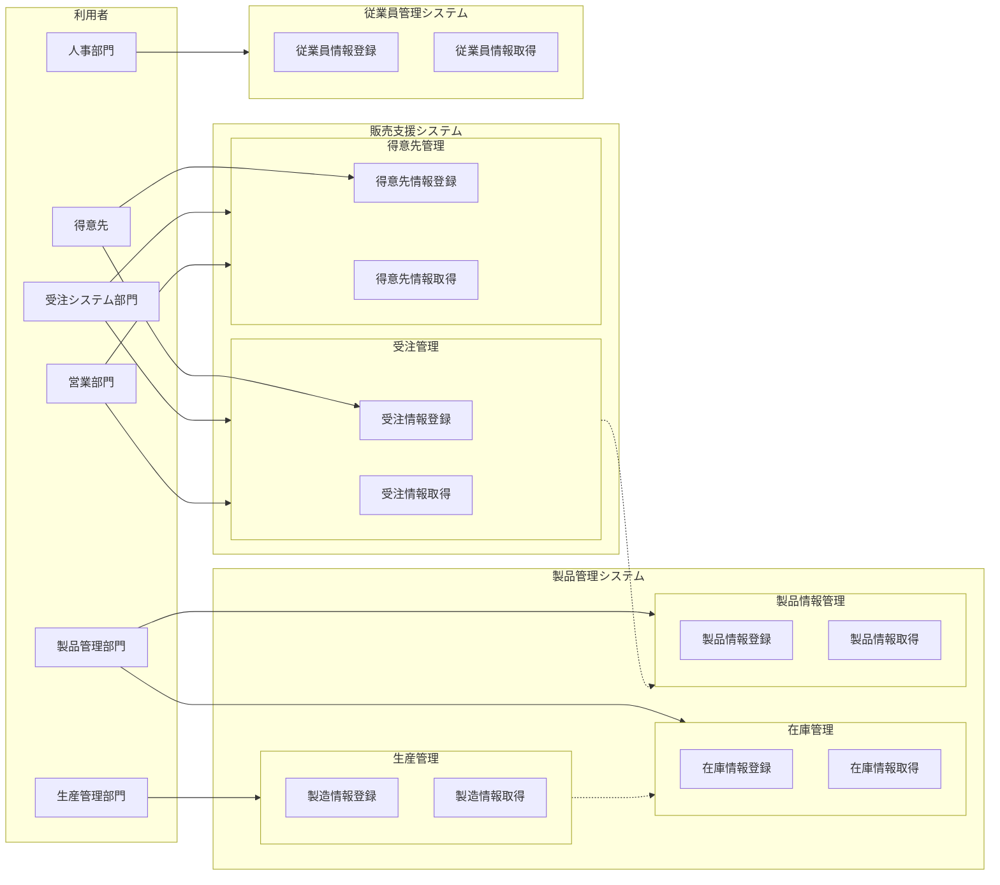

```mermaid
graph LR
    %% アクターの定義
    subgraph Actors[利用者]
        得意先[得意先]
        受注システム部門[受注システム部門]
        営業部門[営業部門]
        生産管理部門[生産管理部門]
        製品管理部門[製品管理部門]
        人事部門[人事部門]
    end

    subgraph SalesSystem[販売支援システム]
        subgraph OrderManagement[受注管理]
            受注登録[受注情報登録]
            受注取得[受注情報取得]
        end
        
        subgraph CustomerManagement[得意先管理]
            顧客登録[得意先情報登録]
            顧客取得[得意先情報取得]
        end
    end

    subgraph ProductSystem[製品管理システム]
        subgraph ProductionManagement[生産管理]
            製造登録[製造情報登録]
            製造取得[製造情報取得]
        end

        subgraph InventoryManagement[在庫管理]
            在庫登録[在庫情報登録]
            在庫取得[在庫情報取得]
        end

        subgraph ProductInfo[製品情報管理]
            製品登録[製品情報登録]
            製品取得[製品情報取得]
        end
    end

    subgraph EmployeeSystem[従業員管理システム]
        従業員登録[従業員情報登録]
        従業員取得[従業員情報取得]
    end

    %% 主要な関連付け
    得意先 --> 顧客登録
    得意先 --> 受注登録
    
    受注システム部門 --> OrderManagement
    受注システム部門 --> CustomerManagement
    
    営業部門 --> OrderManagement
    営業部門 --> CustomerManagement
    
    生産管理部門 --> ProductionManagement
    
    製品管理部門 --> ProductInfo
    製品管理部門 --> InventoryManagement
    
    人事部門 --> EmployeeSystem
    
    %% システム間の主要な連携
    OrderManagement -.-> ProductInfo
    ProductionManagement -.-> InventoryManagement
```