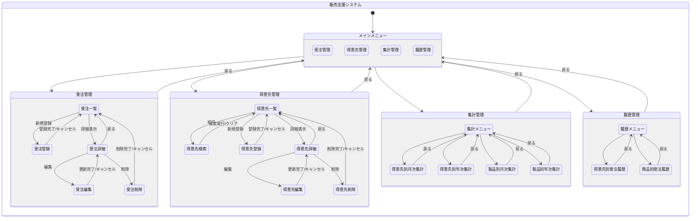

```mermaid
stateDiagram-v2
    state "販売支援システム" as SalesSystem {
        [*] --> メインメニュー
        
        state メインメニュー {
            state "受注管理" as order_menu
            state "得意先管理" as customer_menu
            state "集計管理" as summary_menu
            state "履歴管理" as history_menu
        }

        state 受注管理 {
            state "受注一覧" as order_list
            state "受注登録" as order_new
            state "受注詳細" as order_detail
            state "受注編集" as order_edit
            state "受注削除" as order_delete
            
            order_list --> order_new: 新規登録
            order_list --> order_detail: 詳細表示
            order_detail --> order_edit: 編集
            order_detail --> order_delete: 削除
            order_new --> order_list: 登録完了/キャンセル
            order_edit --> order_detail: 更新完了/キャンセル
            order_delete --> order_list: 削除完了/キャンセル
            order_detail --> order_list: 戻る
        }
        
        state 得意先管理 {
            state "得意先一覧" as customer_list
            state "得意先検索" as customer_search
            state "得意先登録" as customer_new
            state "得意先詳細" as customer_detail
            state "得意先編集" as customer_edit
            state "得意先削除" as customer_delete
            
            customer_list --> customer_search: 検索
            customer_list --> customer_new: 新規登録
            customer_list --> customer_detail: 詳細表示
            customer_detail --> customer_edit: 編集
            customer_detail --> customer_delete: 削除
            customer_search --> customer_list: 検索実行/クリア
            customer_new --> customer_list: 登録完了/キャンセル
            customer_edit --> customer_detail: 更新完了/キャンセル
            customer_delete --> customer_list: 削除完了/キャンセル
            customer_detail --> customer_list: 戻る
        }

        state 集計管理 {
            state "集計メニュー" as summary_submenu
            state "得意先別月次集計" as customer_monthly
            state "得意先別年次集計" as customer_yearly
            state "製品別月次集計" as product_monthly
            state "製品別年次集計" as product_yearly
            
            summary_submenu --> customer_monthly
            summary_submenu --> customer_yearly
            summary_submenu --> product_monthly
            summary_submenu --> product_yearly
            customer_monthly --> summary_submenu: 戻る
            customer_yearly --> summary_submenu: 戻る
            product_monthly --> summary_submenu: 戻る
            product_yearly --> summary_submenu: 戻る
        }

        state 履歴管理 {
            state "履歴メニュー" as history_submenu
            state "得意先別受注履歴" as customer_history
            state "商品別受注履歴" as product_history
            
            history_submenu --> customer_history
            history_submenu --> product_history
            customer_history --> history_submenu: 戻る
            product_history --> history_submenu: 戻る
        }

        メインメニュー --> 受注管理
        メインメニュー --> 得意先管理
        メインメニュー --> 集計管理
        メインメニュー --> 履歴管理
        
        受注管理 --> メインメニュー: 戻る
        得意先管理 --> メインメニュー: 戻る
        集計管理 --> メインメニュー: 戻る
        履歴管理 --> メインメニュー: 戻る
    }
```